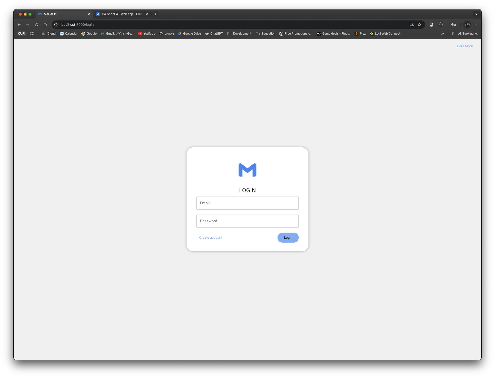
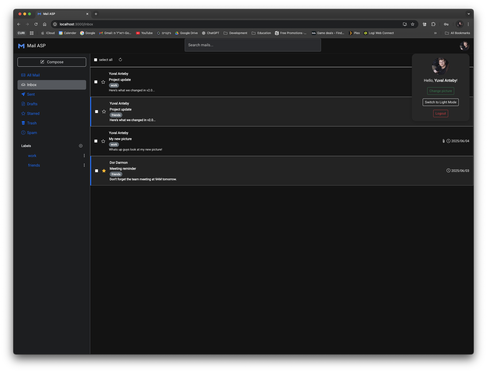
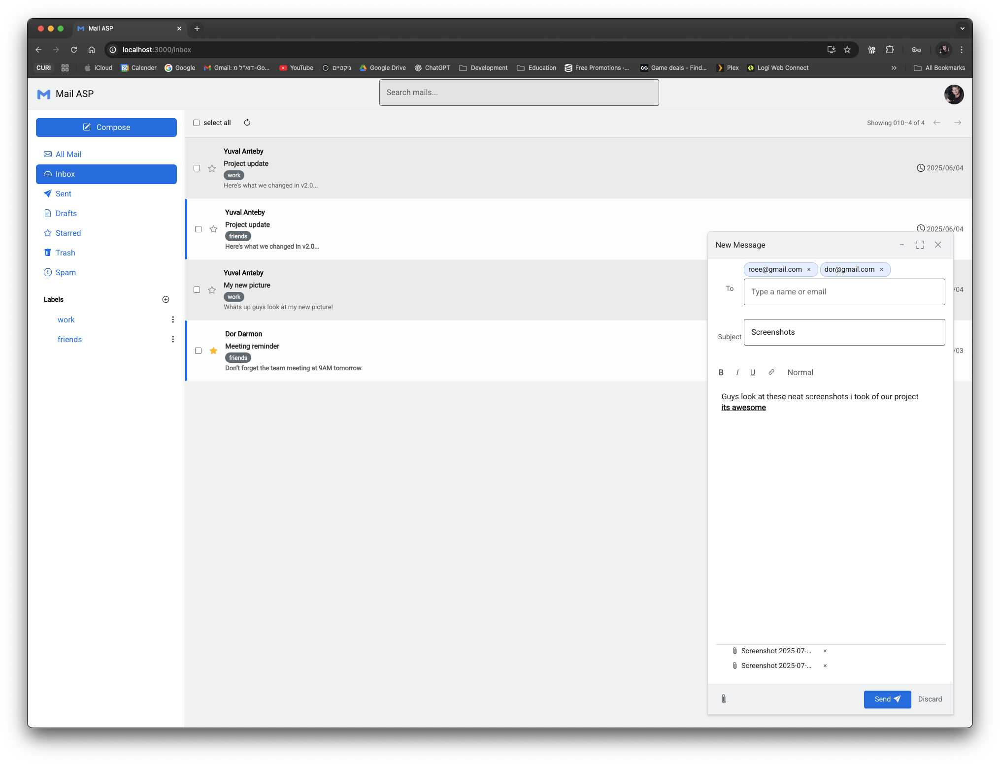
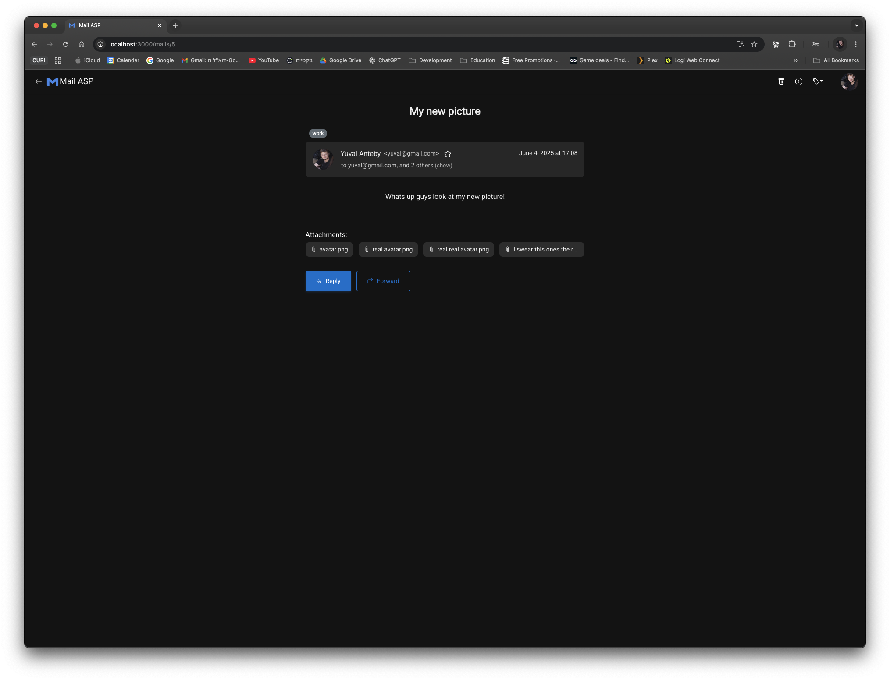
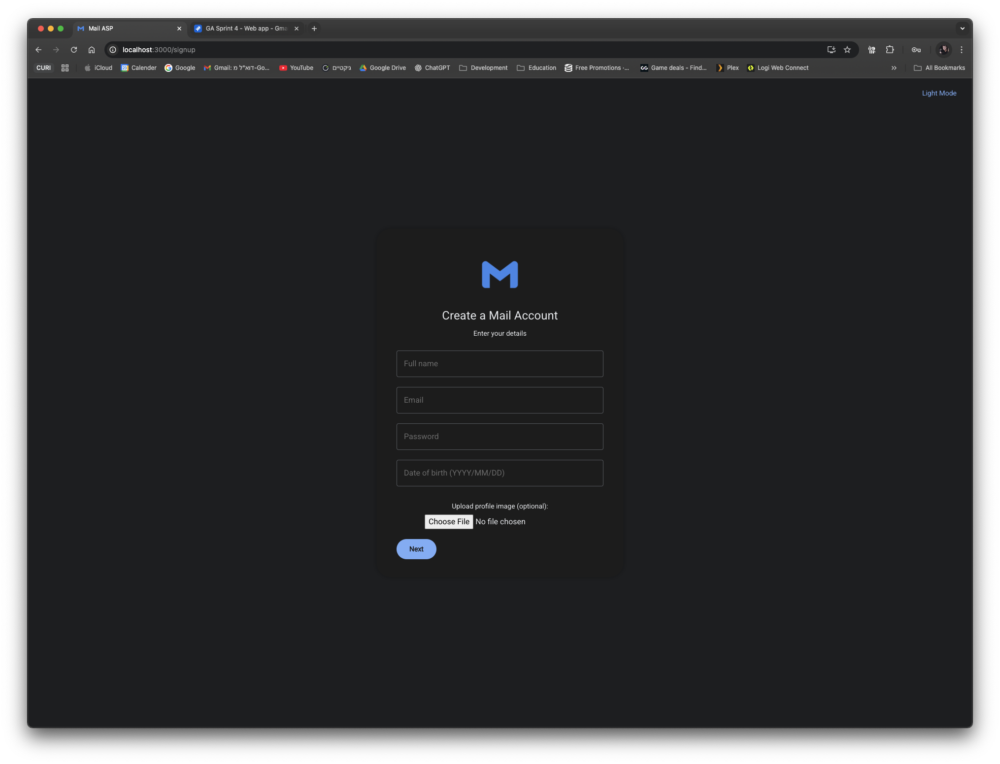

# Gmail-AdvancedSystemProgramming
Daily meeting summaries are uploaded to `Issues` tab
Roee's miluim service documents are uploaded to `Issues` tab if needed, Tzvika was informed about it.

## Dear TA please check main-Ex4 for the final version of Ex4

---

## Table of Contents
- [Running server and client](#testing-and-running)
  - [Getting started](#getting-started)
  - [Testing bloom filter server and python client](#to-test-the-python-client-and-bloom-filter-server) 
  - [Running as web application project](#running-the-entire-web-app)
  - [env variables](#env-variables)
- [Screenshots](#screenshots)
- [Useful links](#useful-links)
  - [CPP server README](https://github.com/YuvalAnteby/Gmail-AdvancedSystemProgramming/tree/main-Exe/server_cpp) 
  - [Python client README](https://github.com/YuvalAnteby/Gmail-AdvancedSystemProgramming/blob/main-Ex3/python_client/README.md)
  - [JavaScript server README](https://github.com/YuvalAnteby/Gmail-AdvancedSystemProgramming/blob/main-Ex3/web_server/README.md)

---

## Testing and Running
### Getting started
First clone the project
```bash
git clone https://github.com/YuvalAnteby/Gmail-AdvancedSystemProgramming.git
cd Gmail-AdvancedSystemProgramming/python_client
```
**If you want to change the configuration (ports, names, bloom filter integers etc.) you can do it in dockerfiles 
and docker compose.**

### To test the python client and bloom filter server
This will build and run only the test related containers (CPP server, gtest, python test)
```bash
  docker-compose --profile tests up --build
```

### Running the entire web app
This will build and run only the web application related containers (React, Node.js, CPP server)
```bash
  docker-compose --profile web_app up --build
```

### env variables
In Node.js and React root folders you can find .env files with default values to help you check the project.</br>
In a real world application these wouldn't be uploaded, we did it for easier set up for the checkers :)

### Running the python client
**NOTE: The instructions didn't ask to run the python client and express server together using the same command**
```bash
  docker-compose run client --build
```

- Remainder, to exit the container gracefully use
```bash
control+c
```

---

### Screenshots
<details>
<summary>Click to expand Ex4 screenshots</summary>







</details>

For more screenshots [click here](https://github.com/YuvalAnteby/Gmail-AdvancedSystemProgramming/tree/main-Ex4/screenshots/ex4)

---

## Useful links
- [CPP server README](https://github.com/YuvalAnteby/Gmail-AdvancedSystemProgramming/blob/main-Ex4/server_cpp)
- [JavaScript server README](https://github.com/YuvalAnteby/Gmail-AdvancedSystemProgramming/blob/main-Ex4/web_server/README.md)
- [React frontend README](https://github.com/YuvalAnteby/Gmail-AdvancedSystemProgramming/blob/main-Ex4/frontend/README.md)

---
