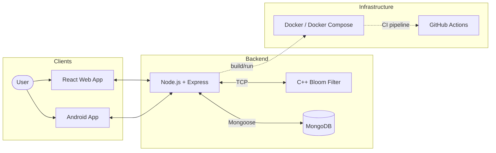
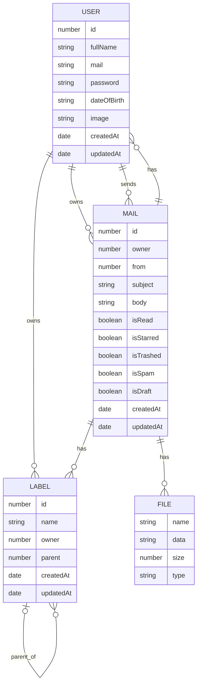

# Gmail-AdvancedSystemProgramming

This is a full-stack Gmail-like system built as part of an advanced programming university course.</br>
It includes a Node.js + Express backend, React frontend, Android mobile client, and a custom C++ Bloom filter for spam detection.</br>
The project was built following TDD and Agile methodologies, adhering to SOLID principles.

<p align="center"> 
    
    
    
    
</p>

<p align="center">
    
    
</p>
<p align="center">
    
</p>

---

## Table of Contents
- [Tech Stack](#tech-stack)
  - [Project Architecture](#project-architecture)
  - [DB schemas](#db-schemas)
- [Running server and client](#testing-and-running)
  - [Getting started](#getting-started)
  - [Testing bloom filter server and python client](#to-test-the-python-client-and-bloom-filter-server) 
  - [Running as web application project](#running-the-entire-web-app)
  - [env variables](#env-variables)
  - [Running the android app](#running-the-android-app)
- [Screenshots](#screenshots)
- [Useful links](#useful-links)
  - [CPP server README](https://github.com/YuvalAnteby/Gmail-AdvancedSystemProgramming/tree/main-Exe/server_cpp) 
  - [Python client README](https://github.com/YuvalAnteby/Gmail-AdvancedSystemProgramming/blob/main-Ex3/python_client/README.md)
  - [JavaScript server README](https://github.com/YuvalAnteby/Gmail-AdvancedSystemProgramming/blob/main-Ex3/web_server/README.md)
- [Teammates](#teammates)

---

## Tech Stack
- Backend: Node.js with Express for handling IO between users and backend.</br>
C++ for handling the Bloom Filter in spam detection.
- Frontend: React.js for web, Android using Java + XML for mobile.
- Database: MongoDB 
- DevOps: Dockerized using docker compose and implemented CI using GitHub Actions to run tests before approving PRs 

### Project Architecture
<details>
<summary>Click to view project's architecture </summary>



</details>

### DB schemas
<details>
<summary>Click to view DB schemas</summary>



</details>

---

## Testing and Running
### Getting started
First clone the project
```bash
git clone https://github.com/YuvalAnteby/Gmail-AdvancedSystemProgramming.git
cd Gmail-AdvancedSystemProgramming/python_client
```
**If you want to change the configuration (ports, names, bloom filter integers etc.) you can do it in dockerfiles 
and docker compose.**

### To test the python client and bloom filter server
This will build and run only the test related containers (CPP server, gtest, python test)
```bash
  docker compose --profile tests up --build
```

### Running the entire web app
This will build and run only the web application related containers (React, Node.js, CPP server)
```bash
  docker compose --profile web_app up -d --build web_server mongo
```

#### env variables
In Node.js and React root folders you can find .env files with default values to help you check the project.</br>
In a real world application these wouldn't be uploaded, we did it for easier set up for the checkers :)

### Running the python client
**NOTE: The instructions didn't ask to run the python client and express server together using the same command**
```bash
  docker compose run client --build
```

- Reminder, to exit the container gracefully use
```bash
control+c
```

### Running the android app
0. ensure the backend is running using docker using the previous instructions
1. Download and install the official android studio software
2. Set up an emulator device using an API version of 26 or greater (most modern phones will suffice)
3. You can install the project's app using 2 versions:
  - Easy way:
     1. get from the root folder the given APK file
     2. ensure the emulator's device is up and running
     3. drag the file to the emulator's window, it will be installed in it
  - The Custom way:
      1. Open android studio when targeting the folder `android_app` instead of the root folder
      2. Wait for android studio to finish the intial gradle build of the project
      3. click on the green run button using the built in tools and set up to your desire

- in case you need to change the backend's API URL you can do so in `gradle.properties` located in the sub root folder `android_app`
---

### Screenshots
<details>
<summary>Click to expand Ex5 screenshots</summary>


</details>

For more screenshots [click here](https://github.com/YuvalAnteby/Gmail-AdvancedSystemProgramming/tree/main-Ex5/screenshots/ex5)

---

## Useful links
- [CPP server README](https://github.com/YuvalAnteby/Gmail-AdvancedSystemProgramming/blob/main-Ex4/server_cpp)
- [JavaScript server README](https://github.com/YuvalAnteby/Gmail-AdvancedSystemProgramming/blob/main-Ex4/web_server/README.md)
- [React frontend README](https://github.com/YuvalAnteby/Gmail-AdvancedSystemProgramming/blob/main-Ex4/frontend/README.md)

---

## Teammates
- [Yuval Anteby](https://github.com/YuvalAnteby)
- [Roee Chaim](https://github.com/RoeeHaim)
- [Dor Darmon](https://github.com/dor-darmon)

---