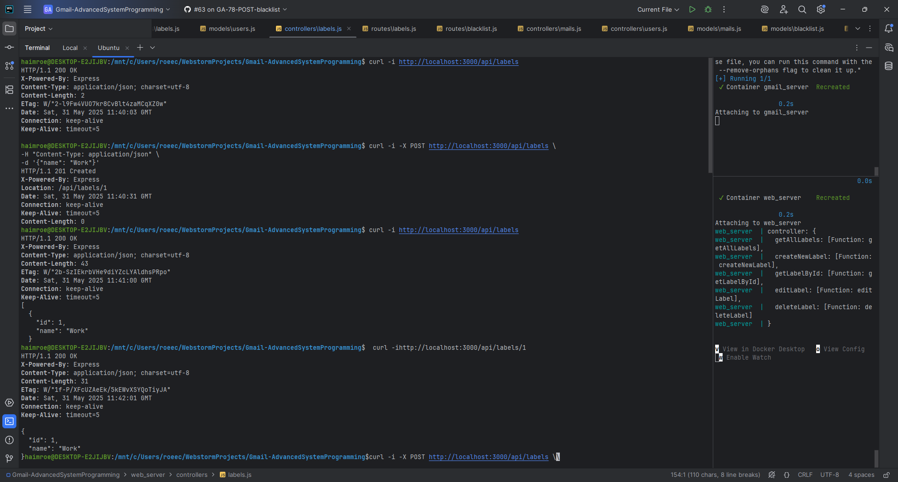
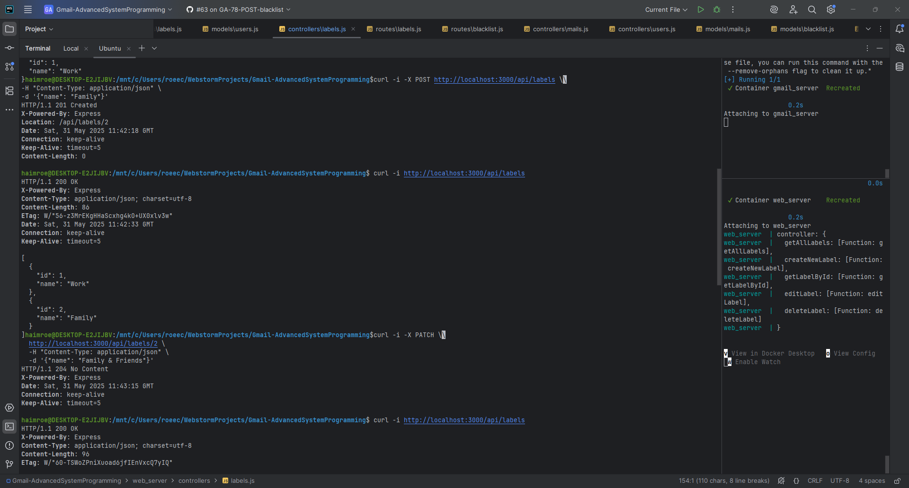
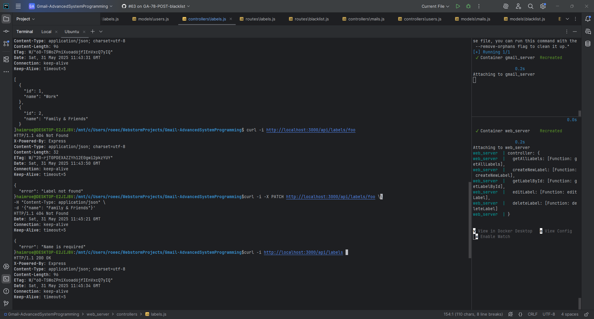
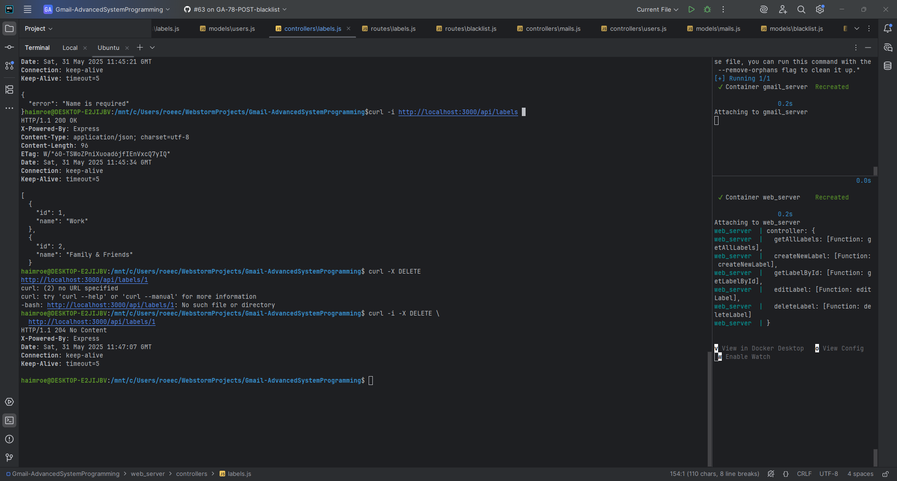
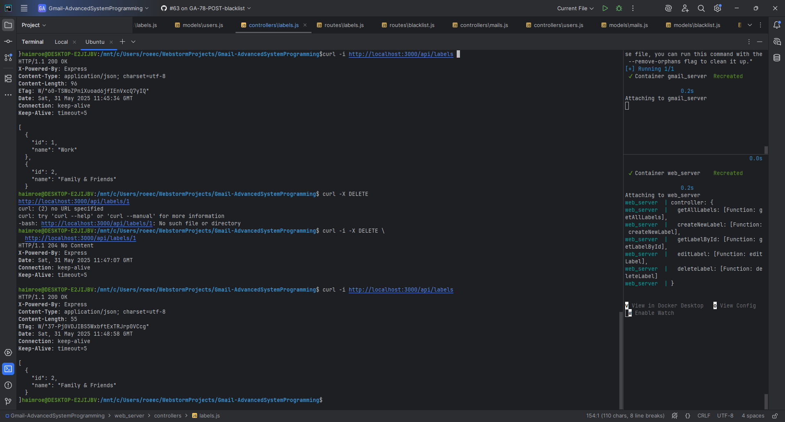

# Gmail-AdvancedSystemProgramming

## Dear TA please check main-Ex1 for the final version of Ex1
## Dear TA please check main-Ex2 for the final version of Ex2
## Dear TA please check main-Ex3 for the final version of Ex3

---

## Table of Contents
- [Running server and client](#testing-or-running-the-server-and-client-as-project)
- [Screenshots](#screenshots)
  - [Ex2](#ex2-screenshots)
- [Answers to Ex2 questions](#answers-to-ex2-questions)
- [Useful links](#useful-links)
  - [CPP server README]() 
  - [Python client README]()

---

### Testing or Running the server and client as project
Clone the project
```bash
git clone https://github.com/YuvalAnteby/Gmail-AdvancedSystemProgramming.git
cd Gmail-AdvancedSystemProgramming/python_client
```

- To test the project
```bash
  docker-compose run --build --rm gtest
  docker-compose run --build --rm test_client
```
1. Build the project
```bash
  docker-compose build
```
3. Run the server
```bash
  docker-compose up run_server
```
2. Run the client
```bash
  docker-compose run  python_client
```
- Remainder, to exit the container gracefully use
```bash
control+c
```

### Screenshots

**#### Ex2 screenshots
<details>
<summary>Click to expand Ex2 screenshots</summary>


</details>**

---

### Answers to Ex2 questions
1. Did the change of commands names made us modify closed to modification code?
Partially, previously we had '1' and '2' options, we didn't have to modify the code since we could use a
function to convert commands like GET or POST to the correct numbers.
To make the code more readable we decided to use enums instead of numbers, allowing us to convert the 
new names to ints and back as needed.
This small change ensured we still have readable code and doesn't have to modify the code in the future.

2. Did the addition of DELETE command made us modify closed to modification code?
No, we only added the new delete function to the data persistence related class and interface without
modifying any previous code.
In Ex1 we decided on using an interface with different functions related to each data type (bits, urls etc.)
and different use cases (getting, inserting), therefore we could just add a new function of delete url now.

3. Did the change of commands' output made us modify closed to modification code?
Yes, previously we had the prints in the execute function of each command.
We decided to use a new object of result which includes if we succeeded and messages to print as needed.
In addition, we used enums for results, and a helper function to convert them to messages, 
this change ensures we would only need to add new messages to the conversion function and not modify.

4. Did the change of console IO to TCP made us modify closed to modification code?
Yes, previously we used cout/cin for IO needs.
To prevent future modifications we use a decorator and strategy design patterns, using an interface for input
and one for output, each has concrete classes for TCP, console and in future more as needed.
In case we'll need to change IO method we could change the type at the start of main function.
5. 
---

## Useful links
- [CPP server README](https://github.com/YuvalAnteby/Gmail-AdvancedSystemProgramming/tree/main-Ex2/server_cpp)
- [Python client README](https://github.com/YuvalAnteby/Gmail-AdvancedSystemProgramming/blob/main-Ex2/python_client/README.md)

---
#### Ex3 screenshots
<details>
<summary>Click to expand Ex3 screenshots</summary>







</details>
